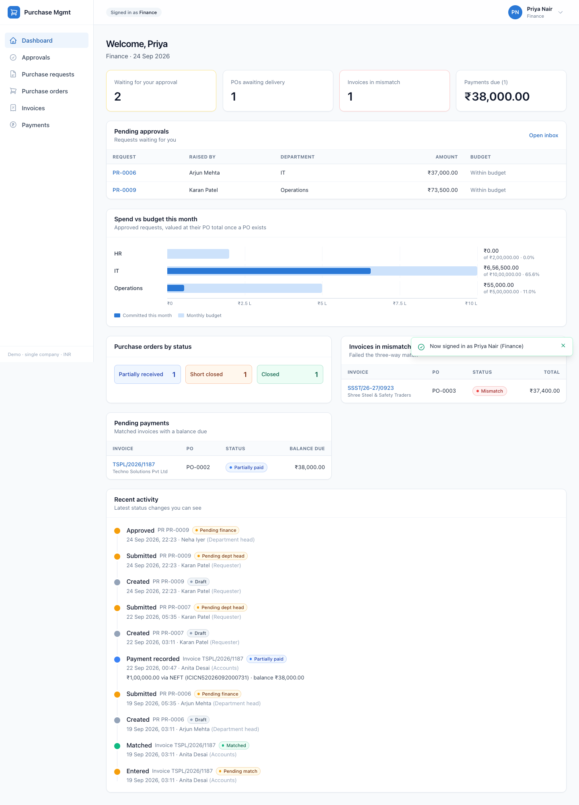
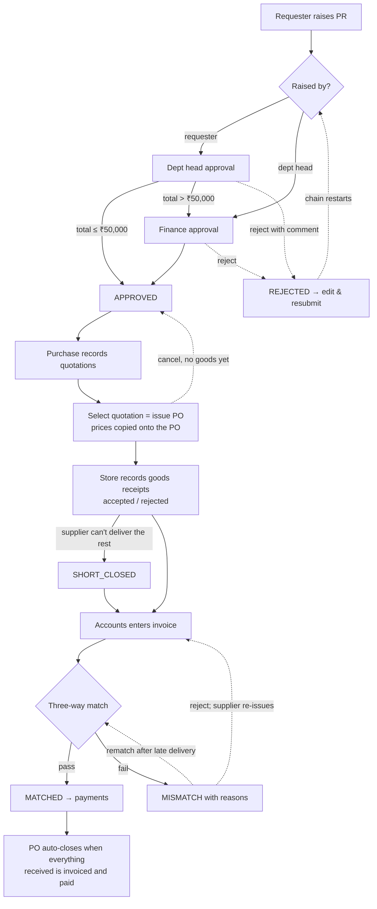
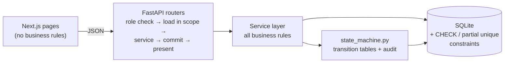
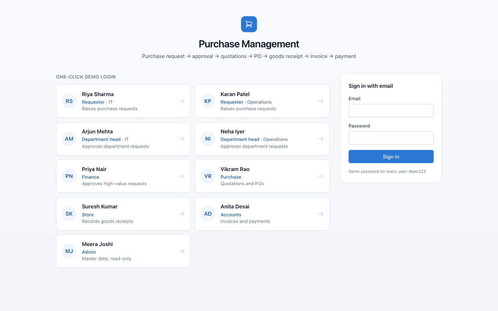
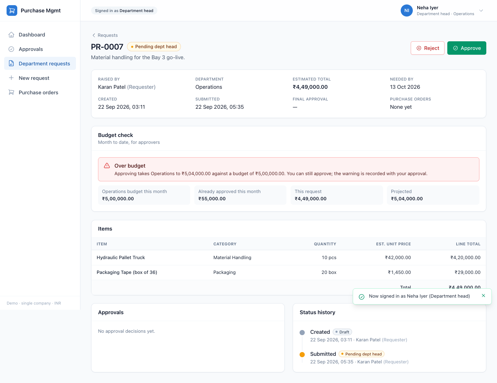
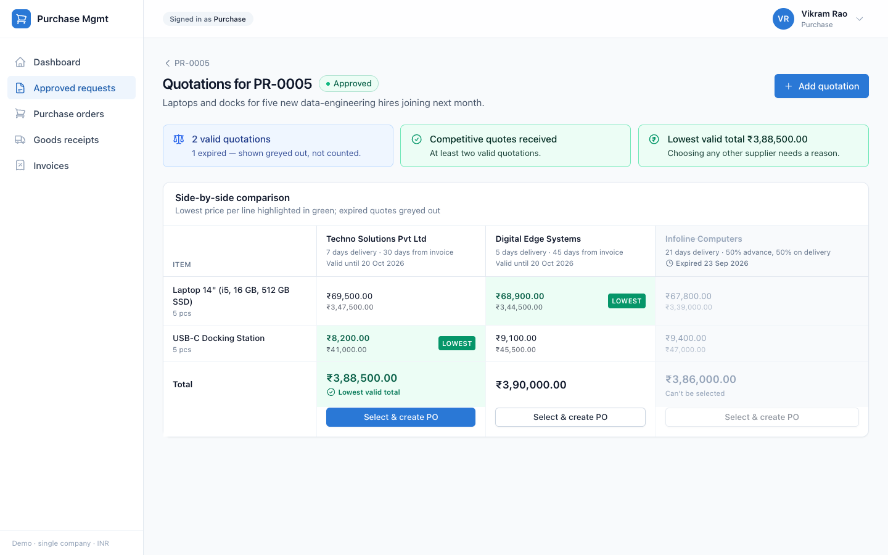
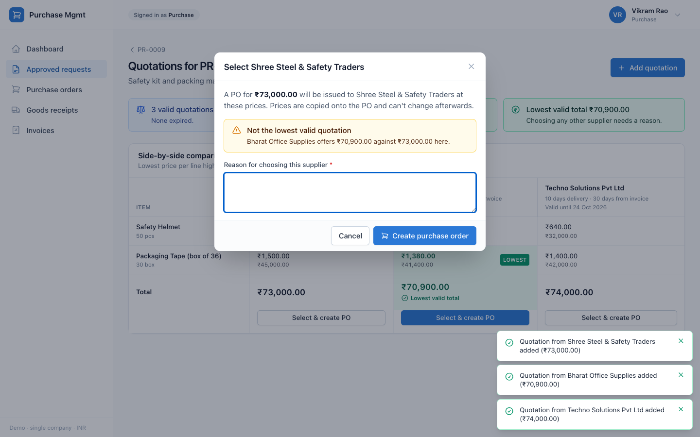
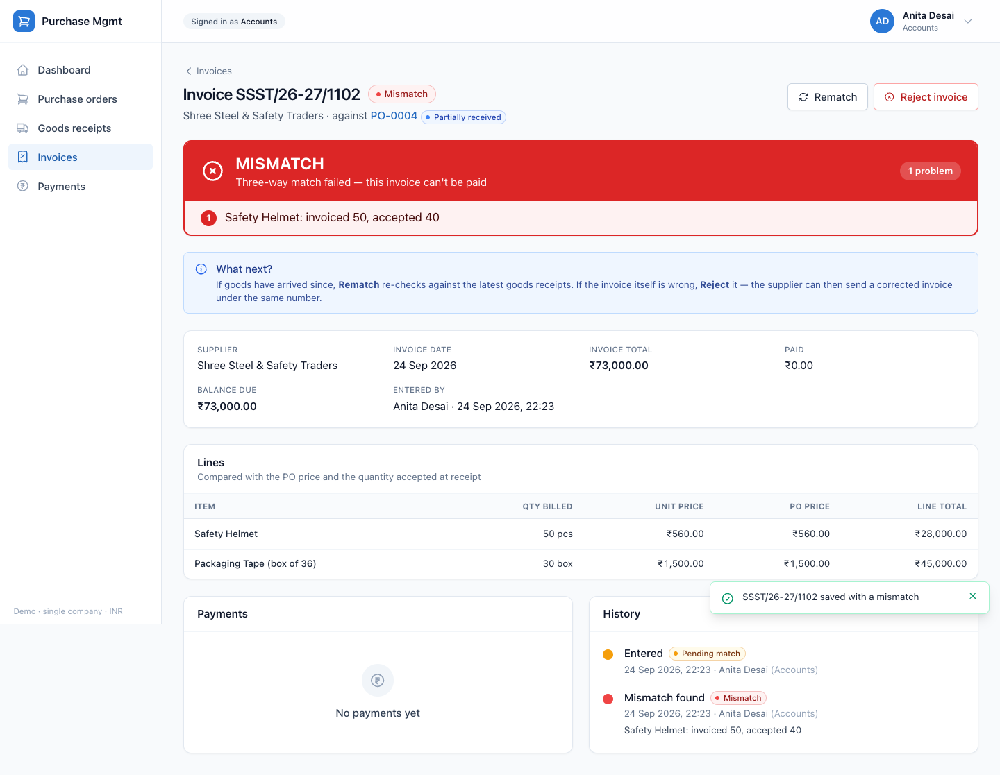
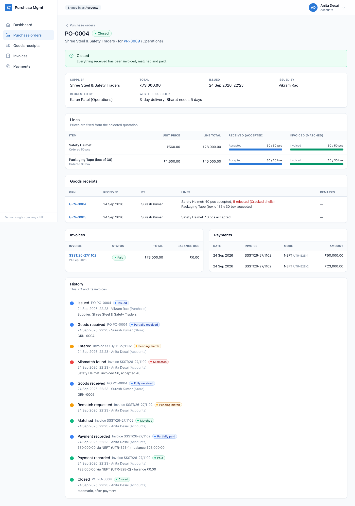

# Purchase Management System (procure-to-pay)

A workflow application that controls how a company buys things, from the first request to the
final payment. Built with FastAPI + SQLAlchemy + SQLite and Next.js 14.



## The business problem

Departments buy laptops, raw material and stationery. When buying isn't controlled, money leaks:
overspending, duplicate orders, invoices for goods that never arrived, invoices at the wrong price.
This system puts every purchase through one controlled path — request → approval → competing
quotes → purchase order → goods receipt → supplier invoice → **three-way match** → payment — where
each step is done by a different role and every status change is recorded.

It is a **workflow** application, not CRUD: records change status only through defined actions,
and the backend rejects any action the current status or the user's role doesn't allow.

## Roles and segregation of duties

| Role | Does | Cannot |
|---|---|---|
| **Requester** | Raises purchase requests (PRs) for their department | Approve anything |
| **Dept head** | Approves/rejects PRs of their own department; may raise PRs | Approve their own PR — it goes to Finance instead |
| **Finance** | Second approval for PRs above ₹50,000; the only approver of dept heads' PRs | Raise PRs, create POs |
| **Purchase** | Records quotations, selects one (which issues the PO), cancels or short-closes POs | Approve PRs, receive goods, pay |
| **Store** | Records goods receipts (accepted / rejected quantities) | See invoices or payments |
| **Accounts** | Enters supplier invoices, rematches or rejects mismatches, records payments | Create POs or receive goods |
| **Admin** | Manages departments, users, suppliers, items and settings; reads everything | Take any transactional action |

Nobody can approve their own request. Requesters and dept heads only see documents linked to
their own / their department's PRs; a draft is visible only to its author. Records outside your
scope return **404** (you can't even tell they exist); actions your role can't take return **403**.

## Process flow



## Key business rules

- **Approval routing.** A requester's PR goes to their dept head; above the finance threshold
  (₹50,000, configurable, read at the moment the dept head approves) it then needs Finance. A dept
  head's own PR skips straight to Finance, whatever the amount. Rejection needs a comment;
  resubmitting restarts the whole chain.
- **Budget warning.** Approvers see the department's approved spend this month (valued at the PO
  total once a PO exists) plus this request, against the monthly budget. Over budget is a warning,
  not a block — and the warning the approver saw is stored with their decision.
- **Quotations.** Every PR line must be priced; one quote per supplier. Selecting needs a
  justification if fewer than two *valid* quotes exist, and a reason if it isn't the lowest *valid*
  total. Expired quotes are shown but can't be selected and don't count.
- **Purchase order.** Selection and PO creation are one atomic action; prices are copied onto the
  PO and never read from the quotation again. A PO can be cancelled only before any goods receipt
  (even one where everything was rejected); the PR then returns to *Approved*.
- **Goods receipt.** Accepted + rejected = received; cumulative accepted can't exceed ordered.
  PO status follows accepted quantity (issued → partially → fully received).
- **Three-way match** (PO price × accepted quantity × invoice), per line: the unit price must equal
  the PO price to the paisa; already-invoiced + this invoice must not exceed accepted; the printed
  total must equal the sum of the lines. Every failure is listed, e.g.
  *"Safety Helmet: invoiced 50, accepted 40"*. Only matched invoices count as invoiced. A mismatch
  can be **rematched** (e.g. after a late delivery) or **rejected**, which frees the invoice number
  for the supplier's corrected invoice.
- **Payments.** Only on matched invoices; partial payments allowed; never more than the balance.
- **Short-close.** Purchase can close a partially received PO when the rest will never arrive (with
  a reason). No more receipts; accepted goods are still invoiced and paid.
- **Auto-close.** A fully received or short-closed PO closes itself once every accepted unit is
  invoiced and every non-rejected invoice is paid — checked after each payment, invoice rejection
  and short-close. An open mismatch blocks closure.
- **Audit.** Every status change writes an audit row in the same transaction; each detail page shows
  the timeline.

Each rule, and the reason behind it, is recorded in [DECISIONS.md](DECISIONS.md) (D-01 … D-58).

## Assumptions

- Single company, several departments, one currency (INR); prices are GST-inclusive.
- One PR → one active PO (splitting a PR across suppliers is a future enhancement).
- Payments are recorded, not processed through a gateway.
- Quotations are entered by the purchase officer (no supplier portal); only Admin onboards suppliers.
- "This month" is the calendar month in IST.
- Each user has exactly one role; only requesters and dept heads belong to a department.

## Tech stack and architecture

| Layer | Choice |
|---|---|
| Backend | Python 3.11+, FastAPI, SQLAlchemy 2, Pydantic v2, SQLite |
| Frontend | Next.js 14 (App Router), TypeScript, Tailwind CSS |
| Auth | JWT (bearer); seeded demo users |
| Tests | pytest, FastAPI TestClient, Playwright |



- **Thin routes.** A handler checks the role, loads the record within the caller's visibility scope
  (404 otherwise), calls one service function, commits, and returns a presenter's response. No rules
  in routers ([`backend/app/api/routers`](backend/app/api/routers)).
- **Service layer.** Every rule lives in [`backend/app/services`](backend/app/services). Each action
  runs in a savepoint, so a failed action leaves no partial changes, audit rows or used document
  numbers. All status changes go through one state machine
  ([`state_machine.py`](backend/app/services/state_machine.py)) that checks an explicit transition
  table and writes the audit row.
- **Actions-driven UI.** Every detail response includes `actions` — what *this user* can do *now*.
  The frontend shows exactly those buttons and never decides permissions itself; error messages come
  from the API and are shown verbatim.
- **Exact money.** Amounts are stored as integer paise and handled as `Decimal`; line amounts round
  half-up to the paisa; the frontend formats the API's decimal strings (₹6,00,000.00) and does any
  preview arithmetic without floats.
- **Defence in depth.** The database backs the key rules with CHECK constraints and partial unique
  indexes (e.g. one live PO per PR, unique live invoice numbers per supplier).

Design documents: [SPEC.md](SPEC.md) (requirements), [docs/DESIGN.md](docs/DESIGN.md) (structure,
ER diagram, state machines, API table), [DECISIONS.md](DECISIONS.md) (every decision and why).

## How to run

Requirements: **Python 3.11+**, **Node.js 18.17+** (and Google Chrome for the E2E tests).

```bash
./dev.sh            # installs everything on first run, seeds demo data, starts both servers
```

Open **http://localhost:3000** and click any demo user (password for all: `demo123`).
API docs: http://localhost:8000/docs. Ctrl-C stops both servers.

```bash
./dev.sh --reset    # restore the exact demo starting data (also works while the app is running)
```

After the first run no internet is needed — the demo works offline (system fonts, locally served API
docs; the E2E test fails if any request leaves the machine). To run on other ports:
`PMS_BACKEND_PORT=8100 PMS_FRONTEND_PORT=3100 ./dev.sh`.

Separately: `backend/run.sh` (API only), `backend/reset_db.sh` (reseed), `cd frontend && npm run dev`.

## Demo script (≈10 minutes)

Log in by clicking the user's card on the login page; switch users any time from the menu at the
top right. Starting data: 8 PRs and 3 POs in varied states (`./dev.sh --reset` restores it).

| # | Log in as | Do | What it shows |
|---|---|---|---|
| 1 | **Karan Patel** (Requester, Operations) | *New request*: 50 Safety Helmets @ ₹600 + 30 Packaging Tape @ ₹1,450 → *Save draft* → *Submit for approval* | PR-0009, ₹73,500, goes to the dept head |
| 2 | **Neha Iyer** (Dept head, Operations) | *Approvals* → open **PR-0007** | Red **over-budget** warning with the numbers (approval is still allowed) |
| 3 | Neha Iyer | Open **PR-0009** → *Approve* | Above ₹50,000 → moves to **Pending finance** |
| 4 | **Arjun Mehta** (Dept head, IT) | Open **PR-0006** (his own) | No approve button — his own PR waits on Finance (D-01) |
| 5 | **Priya Nair** (Finance) | Dashboard, then approve **PR-0009** | Spend-vs-budget chart; PR becomes **Approved** |
| 6 | **Vikram Rao** (Purchase) | PR-0009 → *Quotations & PO* → add 3 quotes: Shree 560/1500, Bharat 590/1380, Techno 640/1400 | Side-by-side table, lowest per line in green, **lowest valid total** marked |
| 7 | Vikram Rao | *Select & create PO* on **Shree** (not the lowest) | Reason field appears; without it the API refuses; with it → **PO-0004** |
| 8 | **Suresh Kumar** (Store) | PO-0004 → *Record goods receipt*: received 45 helmets, rejected 5 "Cracked shells" | Form pre-filled with pending qty; PO → **Partially received** |
| 9 | **Anita Desai** (Accounts) | PO-0004 → *Enter supplier invoice* SSST/26-27/1102, qty 50 helmets | Big red **MISMATCH**: "Safety Helmet: invoiced 50, accepted 40" |
| 10 | Suresh Kumar | PO-0004 → *Record goods receipt* (the remaining 10) | PO → **Fully received** |
| 11 | Anita Desai | Invoice → *Rematch* → pay ₹50,000 → try ₹99,999 → pay ₹23,000 | **MATCHED**; overpayment refused with the balance; last payment **auto-closes** the PO |
| 12 | Anita Desai | Open **PO-0004** | Ordered / accepted / invoiced progress bars, GRNs, invoice, payments, full history |
| 13 | **Meera Joshi** (Admin) | Browse any PR/PO; *Masters* | Sees everything, **no action buttons** anywhere |

Seeded extras worth showing: **PO-0002** is short-closed with a rejected invoice and a corrected
one under the same number (pay its ₹38,000 balance → it closes); **SSST/26-27/0923** is a seeded
MISMATCH to reject; **PR-0004** is rejected with a comment, ready to edit and resubmit.

A one-page version for the day: [docs/DEMO_CHEATSHEET.md](docs/DEMO_CHEATSHEET.md).

## Testing approach

```bash
cd backend && .venv/bin/python -m pytest        # 696 tests, ~15 s
cd frontend && npm run e2e                       # 3 browser tests, ~35 s
cd backend && .venv/bin/python tools/mutation_check.py
```

- **State machines — exhaustive.** Every status × every action for PRs, POs and invoices (342
  generated cases) is checked against the transition tables, plus terminal states and messages.
- **Business rules — one test module per rule** (310 tests): approval routing and escalation,
  self-approval, resubmission, budget warning, quotation and selection rules, PO snapshot, cancel,
  short-close, GRN validation, three-way match pass/fail, rematch/reject, duplicates, overpayment,
  auto-close, visibility scopes, master data, atomic rollback, audit trail. Each test gets a fresh
  SQLite file and a frozen clock, and builds state only through the real services.
- **Seed consistency.** The demo data is built by calling the services, then
  [`verify.py`](backend/app/seed/verify.py) re-checks every invariant; a test proves `--reset`
  produces identical data on any date.
- **API tests** (37): the full P2P flow over HTTP with the right role at each step, plus 401/403/404/
  409/422 bodies, visibility scoping, filters, pagination, dashboards per role and CORS.
- **End-to-end** (Playwright, [`frontend/e2e`](frontend/e2e)): the demo above in a real Chrome at
  laptop size, role-based buttons, and API docs — failing if any request leaves the machine. It runs
  on its own database and ports, so it can run next to a live demo.
- **Mutation check.** [`tools/mutation_check.py`](backend/tools/mutation_check.py) breaks 13 business
  rules one at a time and confirms the suite fails for each (13/13 caught).

## Known limitations and future enhancements

- **SQLite, single writer.** Write transactions are serialised (fine for a demo, guarantees the
  check-then-act rules); production would use PostgreSQL (the partial unique indexes carry over)
  with Alembic migrations — today the schema is recreated on reset.
- **Auth is demo-grade.** JWT in session storage, no refresh tokens, no password reset flow;
  production would use SSO or httpOnly cookies.
- **Scope.** No splitting a PR across suppliers, no PO amendments, no returns/debit notes for
  rejected goods, no GST breakdown, single currency, no attachments (quote PDFs, invoice scans),
  no email notifications.
- **Budget** is a monthly warning only; no hard stops, commitments by category or year-to-date view.
- **Audit log** is append-only in practice but not tamper-evident (no hash chain).
- **UI** is designed for a laptop screen; no mobile layout or internationalisation.

## Screenshots

| | |
|---|---|
| Login with one-click demo users  | PR with over-budget warning  |
| Quotation comparison  | Expired quote greyed out and not counted  |
| Reason required for a non-lowest pick  | Three-way match failed  |
| Closed PO with quantities, documents and history  | Finance dashboard  |
