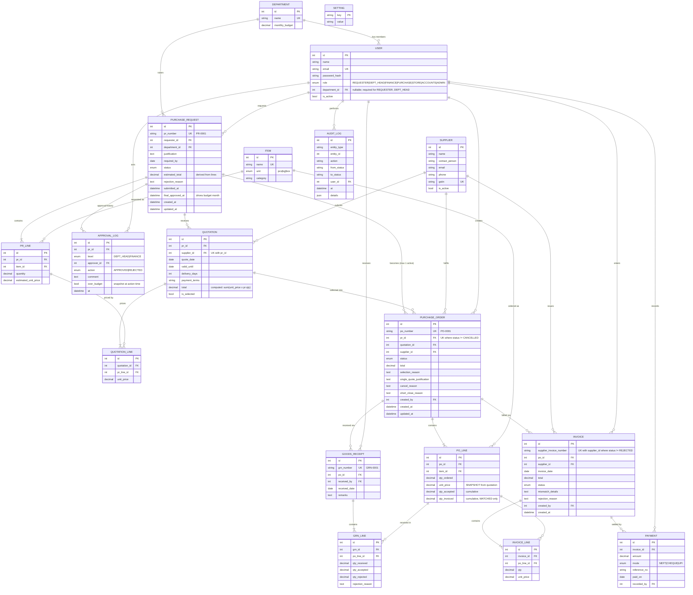
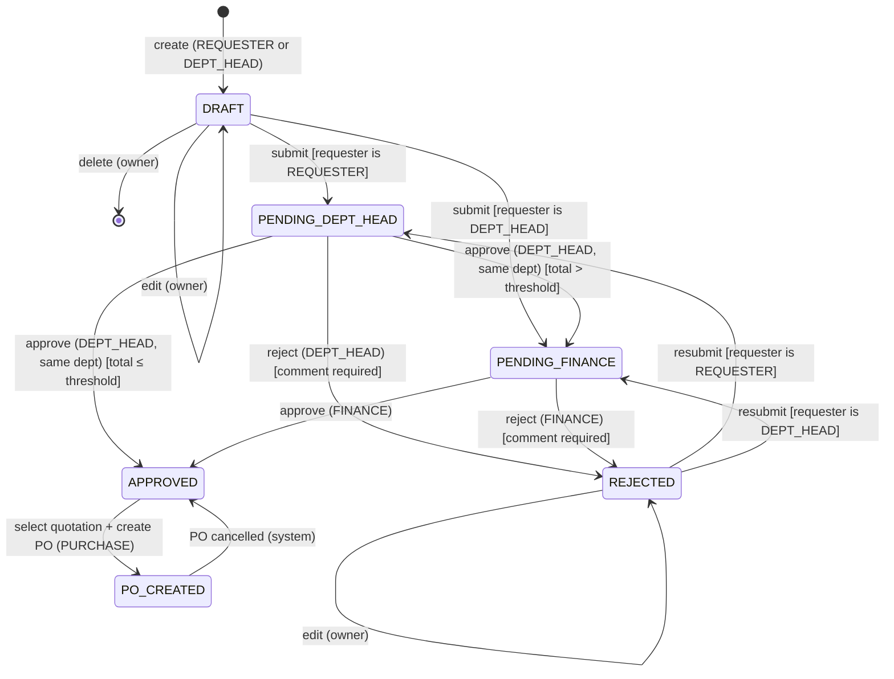
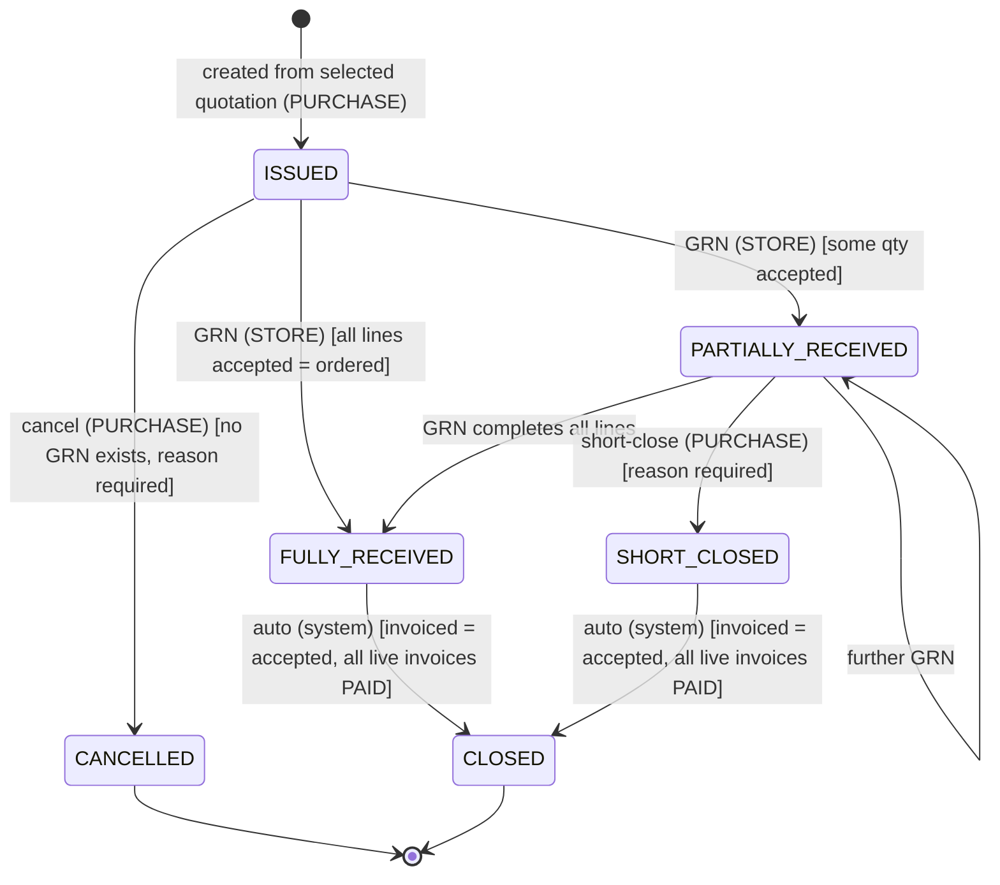
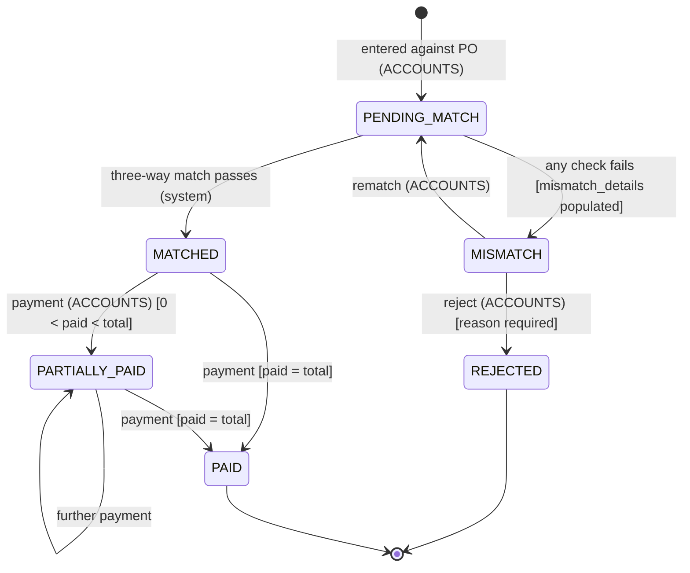

# Purchase Management System — Design

Source of truth: [SPEC.md](../SPEC.md) (revision 2). Decisions and their reasons are in
[DECISIONS.md](../DECISIONS.md); `D-nn` references below point there.

---

## 1. Folder structure

```
purchase-management/
├── SPEC.md
├── README.md                     # setup, assumptions, process flow, demo script
├── DECISIONS.md                  # design decision log
├── docs/
│   └── DESIGN.md                 # this file
│
├── backend/
│   ├── requirements.txt          # deps (D-42)
│   ├── run.sh                    # one command: venv, install, seed on first run, uvicorn (--reset to reseed)
│   ├── reset_db.sh               # one command: drop all tables, recreate, reseed
│   ├── _env.sh                   # shared venv bootstrap for the two scripts
│   ├── app/
│   │   ├── main.py               # FastAPI app, CORS, router registration, error handlers
│   │   ├── core/
│   │   │   ├── config.py         # settings (DB path, JWT secret, token TTL), PMS_* env overrides
│   │   │   ├── clock.py          # now()/today() in IST — the only source of time (D-40)
│   │   │   ├── db.py             # engine, SessionLocal, Base, get_db dependency
│   │   │   ├── security.py       # password hashing, JWT encode/decode
│   │   │   ├── deps.py           # get_current_user, require_roles(...)
│   │   │   └── errors.py         # DomainError, InvalidTransition, NotFound, Forbidden → HTTP mapping
│   │   ├── models/               # SQLAlchemy 2.x ORM (one file per aggregate)
│   │   │   ├── enums.py          # Role, PRStatus, POStatus, InvoiceStatus, PaymentMode, ...
│   │   │   ├── types.py          # Money / Quantity scaled-integer columns (D-38), enum_column()
│   │   │   ├── master.py         # Department, User, Supplier, Item, Setting
│   │   │   ├── purchase_request.py   # PurchaseRequest, PRLine, ApprovalLog
│   │   │   ├── quotation.py      # Quotation, QuotationLine
│   │   │   ├── purchase_order.py # PurchaseOrder, POLine
│   │   │   ├── goods_receipt.py  # GoodsReceipt, GRNLine
│   │   │   ├── invoice.py        # Invoice, InvoiceLine, Payment
│   │   │   ├── audit.py          # AuditLog
│   │   │   └── sequence.py       # document number counters (PR-/PO-/GRN-)
│   │   ├── schemas/              # Pydantic v2 request/response models (mirrors models/)
│   │   ├── services/             # ALL business rules live here — no rules in routers
│   │   │   ├── state_machine.py  # per-entity transition tables + assert_transition()
│   │   │   ├── access.py         # read-scope filters per role (D-08, D-09)
│   │   │   ├── audit_service.py  # record_status_change()
│   │   │   ├── numbering.py      # next_number("PR") → PR-0001
│   │   │   ├── pr_service.py     # create/edit/submit, approval routing, escalation, budget check
│   │   │   ├── quotation_service.py  # add quote, comparison, select
│   │   │   ├── po_service.py     # create (price snapshot), cancel, short-close, auto-close
│   │   │   ├── grn_service.py    # receipt validation, PO status recompute
│   │   │   ├── invoice_service.py    # three-way match, rematch, reject, duplicate check
│   │   │   ├── payment_service.py    # payment validation, invoice/PO status update
│   │   │   ├── dashboard_service.py
│   │   │   └── master_service.py
│   │   ├── api/
│   │   │   └── routers/          # thin: auth → parse → call service → serialize
│   │   │       ├── auth.py
│   │   │       ├── masters.py    # departments, users, suppliers, items, settings
│   │   │       ├── prs.py
│   │   │       ├── quotations.py
│   │   │       ├── pos.py
│   │   │       ├── grns.py
│   │   │       ├── invoices.py
│   │   │       ├── payments.py
│   │   │       ├── dashboard.py
│   │   │       └── audit.py
│   │   └── seed/
│   │       ├── seed.py           # drop + recreate + demo scenarios (D-41)
│   │       └── verify.py         # invariant checks the seed must pass before committing
│   └── tests/
│       ├── conftest.py           # in-memory SQLite, factories, users per role
│       ├── test_state_machines.py
│       ├── test_pr_approval_routing.py   # threshold routing + DEPT_HEAD escalation (D-01)
│       ├── test_pr_resubmit.py           # chain restarts (D-02)
│       ├── test_self_approval.py
│       ├── test_budget_warning.py        # D-05
│       ├── test_quotation_selection.py
│       ├── test_po_creation_snapshot.py
│       ├── test_po_cancel.py             # PR back to APPROVED (D-06)
│       ├── test_po_short_close.py        # D-07
│       ├── test_grn_partial.py
│       ├── test_three_way_match.py
│       ├── test_invoice_rematch_reject.py  # D-03
│       ├── test_duplicate_invoice.py     # incl. REJECTED exclusion
│       ├── test_payments_overpayment.py
│       ├── test_po_auto_close.py         # from FULLY_RECEIVED and SHORT_CLOSED
│       └── test_api_rbac.py              # role + scope access per endpoint, ADMIN read-only
│
└── frontend/
    ├── package.json              # `npm run dev` is the one command
    ├── next.config.js
    ├── tailwind.config.ts
    ├── .env.local.example        # NEXT_PUBLIC_API_URL=http://localhost:8000
    └── src/
        ├── app/
        │   ├── layout.tsx
        │   ├── login/page.tsx            # form + one-click demo-user buttons
        │   └── (app)/                    # authenticated shell (sidebar + header)
        │       ├── layout.tsx            # auth guard, role-based sidebar
        │       ├── dashboard/page.tsx
        │       ├── prs/
        │       │   ├── page.tsx          # list
        │       │   ├── new/page.tsx      # multi-line create (REQUESTER, DEPT_HEAD)
        │       │   └── [id]/
        │       │       ├── page.tsx      # detail, approval timeline, approve/reject, budget warning
        │       │       ├── edit/page.tsx # DRAFT / REJECTED edit
        │       │       └── quotations/page.tsx   # add quotes + comparison + select→PO
        │       ├── approvals/page.tsx    # DEPT_HEAD / FINANCE inbox
        │       ├── pos/
        │       │   ├── page.tsx
        │       │   └── [id]/
        │       │       ├── page.tsx      # quantities, linked docs, cancel / short-close actions
        │       │       ├── receive/page.tsx  # GRN form pre-filled with pending qty
        │       │       └── invoice/page.tsx  # invoice entry → match result
        │       ├── grns/[id]/page.tsx
        │       ├── invoices/
        │       │   ├── page.tsx
        │       │   └── [id]/page.tsx     # MATCHED/MISMATCH banner, rematch/reject, payments, balance due
        │       ├── payments/page.tsx
        │       └── admin/
        │           ├── departments/page.tsx
        │           ├── users/page.tsx
        │           ├── suppliers/page.tsx
        │           ├── items/page.tsx
        │           └── settings/page.tsx
        ├── components/
        │   ├── ui/                       # Button, Table, Modal, Input, Card, Toast
        │   ├── StatusBadge.tsx
        │   ├── StatusTimeline.tsx        # driven by /audit-logs
        │   ├── Sidebar.tsx               # nav config filtered by role
        │   ├── ReasonDialog.tsx          # shared "reason required" modal (reject, cancel, short-close)
        │   ├── LineItemsEditor.tsx
        │   ├── QuotationComparison.tsx
        │   └── MatchResult.tsx
        ├── lib/
        │   ├── api.ts                    # fetch wrapper, JWT header, error → toast
        │   ├── auth.tsx                  # AuthContext, token storage, useRole()
        │   ├── permissions.ts            # which action buttons each role sees (ADMIN: none)
        │   ├── nav.ts                    # sidebar items per role
        │   └── format.ts                 # INR formatting (₹10,00,000), dates
        └── types/api.ts                  # TS types mirroring Pydantic schemas
```

Layering rule: **router → service → model**. Routers never touch status fields directly; every
status change goes through `state_machine.assert_transition()` and
`audit_service.record_status_change()` inside the same DB transaction. The frontend hides
buttons a role can't use, but the backend is the only enforcement point.

---

## 2. ER diagram



Notes
- Money/quantities are `Decimal` in Python and stored as scaled integers — paise (2 dp) and
  thousandths (3 dp) — never float (D-21, D-38). The ER types above show the logical type.
- Unique rules backed by the database (D-32, D-39):
  - `invoice(supplier_id, supplier_invoice_number) WHERE status <> 'REJECTED'`
  - `purchase_order(pr_id) WHERE status <> 'CANCELLED'`
  - `quotation(pr_id) WHERE is_selected = 1` — at most one selected quotation per PR
  - `quotation(pr_id, supplier_id)`, and one line per parent line on quotation/GRN/invoice lines
- CHECK constraints (D-39): every enum column; `grn_line` accepted + rejected = received;
  `po_line` 0 ≤ qty_invoiced ≤ qty_accepted ≤ qty_ordered; reason/comment present on rejected
  approvals, rejected invoices, cancelled and short-closed POs, and rejected GRN quantities;
  `user.department_id` set iff role is REQUESTER/DEPT_HEAD.
- Columns added during implementation, not drawn above: `created_at` on user, quotation,
  goods_receipt, payment; `updated_at` on invoice; `quotation.created_by`. The
  `document_sequence(doc_type PK, last_value)` table holds the number counters (D-31).
- PR ↔ PO is 1-to-many in the schema because cancelled POs stay for audit; at most one is
  non-cancelled (D-06).

---

## 3. State diagrams

### 3.1 Purchase Request



Guards on every approve/reject: approver ≠ requester; approver is active. The budget check
(D-05) is evaluated at each approval step, shown to the approver, and stored as
`ApprovalLog.over_budget`. `final_approved_at` is set on entering APPROVED from a pending
state (not when returning from PO_CREATED).

### 3.2 Purchase Order



- Receipt statuses are **recomputed** from accepted quantities after each GRN (D-18); a GRN
  where everything is rejected leaves the PO in ISSUED but still blocks cancellation (D-17).
- Cancelling sets the PR back to APPROVED and clears `quotation.is_selected` (D-06).
- "Live invoices" = all invoices on the PO except REJECTED ones. A MISMATCH invoice blocks
  closure until it is rematched to MATCHED and paid, or rejected.
- Auto-close is checked after: payment recorded, invoice rejected, PO short-closed (D-34). A
  short-close on an already fully-invoiced-and-paid PO closes it immediately (two audit rows).

### 3.3 Invoice



- PENDING_MATCH is transient: entry and rematch run the match synchronously in the same
  request, but both hops are written to AuditLog so the timeline shows them (D-35).
- On MATCHED, each line's qty is added to `po_line.qty_invoiced`; MISMATCH and REJECTED
  invoices never touch it (D-04).
- Rematch does not edit lines; it re-evaluates against current accepted/invoiced quantities.
- A REJECTED invoice frees its `supplier_invoice_number` for a corrected invoice (D-03).

---

## 4. API endpoints

All under `/api`. JWT bearer on everything except `/auth/login` and `/auth/demo-users`.

Legend: **R** = REQUESTER, **DH** = DEPT_HEAD, **F** = FINANCE, **P** = PURCHASE,
**S** = STORE, **A** = ACCOUNTS, **AD** = ADMIN, **All** = any authenticated user.
Read scopes (D-08): **R⁺** = own PRs and documents linked to them; **DH⁺** = same for the
whole department. ADMIN can call every GET below; it can call no transactional POST/PUT/DELETE
(D-09).

### Auth
| Method | Path | Roles | Notes |
|---|---|---|---|
| POST | `/auth/login` | public | email + password → JWT; inactive users refused |
| GET | `/auth/demo-users` | public | demo accounts for login buttons (demo mode only) |
| GET | `/auth/me` | All | current user + role + department |

### Masters
| Method | Path | Roles | Notes |
|---|---|---|---|
| GET | `/departments` | All | |
| POST / PATCH | `/departments`, `/departments/{id}` | AD | |
| GET | `/users` | AD | |
| POST / PATCH | `/users`, `/users/{id}` | AD | deactivate via `is_active=false`; password reset |
| GET | `/suppliers` | P, A, F, AD | `?active=true` |
| POST / PATCH | `/suppliers`, `/suppliers/{id}` | AD | deactivate, no hard delete (D-10) |
| GET | `/items` | All | needed for PR line picker |
| POST / PATCH | `/items`, `/items/{id}` | AD | |
| GET | `/settings` | AD, F | |
| PUT | `/settings/{key}` | AD | validates known keys |

### Purchase Requests
| Method | Path | Roles | Notes |
|---|---|---|---|
| GET | `/prs` | R⁺, DH⁺, F, P (APPROVED onward), AD | `?status=` |
| POST | `/prs` | R, DH | creates DRAFT with lines |
| GET | `/prs/{id}` | R⁺, DH⁺, F, P, AD | lines, approval log, budget info |
| PUT | `/prs/{id}` | owner | only DRAFT / REJECTED; replaces lines |
| DELETE | `/prs/{id}` | owner | only DRAFT |
| POST | `/prs/{id}/submit` | owner | routes to PENDING_DEPT_HEAD or PENDING_FINANCE (D-01) |
| POST | `/prs/{id}/approve` | DH (same dept, PENDING_DEPT_HEAD); F (PENDING_FINANCE) | optional comment; self-approval blocked |
| POST | `/prs/{id}/reject` | DH (same dept); F | comment **required** |
| GET | `/prs/{id}/budget-check` | DH, F, AD | month-to-date approved total, budget, over-budget flag |
| GET | `/approvals/pending` | DH (own dept), F | approval inbox |

### Quotations
| Method | Path | Roles | Notes |
|---|---|---|---|
| GET | `/prs/{id}/quotations` | P, F, AD | |
| POST | `/prs/{id}/quotations` | P | PR APPROVED; all lines priced; supplier active; one per supplier |
| PUT | `/quotations/{id}` | P | only while PR is APPROVED |
| DELETE | `/quotations/{id}` | P | only while PR is APPROVED and not referenced by a PO |
| GET | `/prs/{id}/quotations/comparison` | P, F, AD | lowest-per-line + lowest-total flags |
| POST | `/prs/{id}/quotations/{qid}/select` | P | not expired; justification/reason rules; creates PO atomically; returns PO |

### Purchase Orders
| Method | Path | Roles | Notes |
|---|---|---|---|
| GET | `/pos` | R⁺, DH⁺, F, P, S, A, AD | `?status=` |
| GET | `/pos/{id}` | same | lines with ordered/accepted/invoiced; linked GRNs, invoices, payments |
| POST | `/pos/{id}/cancel` | P | ISSUED, no GRNs; reason required; PR → APPROVED |
| POST | `/pos/{id}/short-close` | P | PARTIALLY_RECEIVED; reason required; may auto-close |

### Goods Receipts
| Method | Path | Roles | Notes |
|---|---|---|---|
| GET | `/pos/{id}/receivable` | S | pending qty per line for pre-fill |
| POST | `/pos/{id}/grns` | S | PO ISSUED / PARTIALLY_RECEIVED; recomputes PO status |
| GET | `/grns` | R⁺, DH⁺, S, P, A, AD | `?po_id=` |
| GET | `/grns/{id}` | same | |

### Invoices
| Method | Path | Roles | Notes |
|---|---|---|---|
| POST | `/pos/{id}/invoices` | A | PO PARTIALLY_RECEIVED / FULLY_RECEIVED / SHORT_CLOSED (D-25); duplicate check; match; returns status + mismatch_details |
| GET | `/invoices` | R⁺, DH⁺, F, P, A, AD | `?status=MISMATCH` |
| GET | `/invoices/{id}` | same | includes payments and balance due |
| POST | `/invoices/{id}/rematch` | A | MISMATCH only |
| POST | `/invoices/{id}/reject` | A | MISMATCH only; reason required; may trigger PO auto-close |

### Payments
| Method | Path | Roles | Notes |
|---|---|---|---|
| POST | `/invoices/{id}/payments` | A | invoice MATCHED / PARTIALLY_PAID; amount ≤ balance; may trigger PO auto-close |
| GET | `/invoices/{id}/payments` | R⁺, DH⁺, F, A, AD | |
| GET | `/payments` | F, A, AD | |

### Dashboard & Audit
| Method | Path | Roles | Notes |
|---|---|---|---|
| GET | `/dashboard` | All | role-scoped widgets: pending approvals, POs by status, MISMATCH invoices, pending payments, dept spend vs budget |
| GET | `/audit-logs` | All, scoped to entities the caller can read; AD all | `?entity_type=&entity_id=` powers timelines; `?limit=` for recent activity |

---

## 5. Cross-cutting design choices

Logged in DECISIONS.md as D-26 onward.

1. **Transition table per entity** (`{(from, action): to}`) in `state_machine.py`; invalid →
   HTTP 409 `{"error": "INVALID_TRANSITION", "message": "Cannot approve a PR in status DRAFT"}`.
2. **Business-rule violations** → HTTP 422 with a domain error code; **role/scope
   violations** → HTTP 403 with a specific message ("You cannot approve your own request").
   Records outside a caller's read scope → 404, so their existence isn't revealed.
3. **Transactions**: each action runs in one DB transaction including its AuditLog rows.
4. **Derived totals**: `estimated_total`, `quotation.total`, `po.total` computed server-side
   from lines; client-sent totals ignored. Invoice total is the exception: it's what the
   supplier printed, so it's entered and checked (D-20).
5. **Numbering**: sequence table incremented inside the transaction; PR number assigned at
   creation.
6. **Dates**: "this month" = calendar month in server local time (IST).

---

## 6. Open questions

None outstanding. All 25 design-pass questions are resolved in DECISIONS.md (D-01 – D-25).
